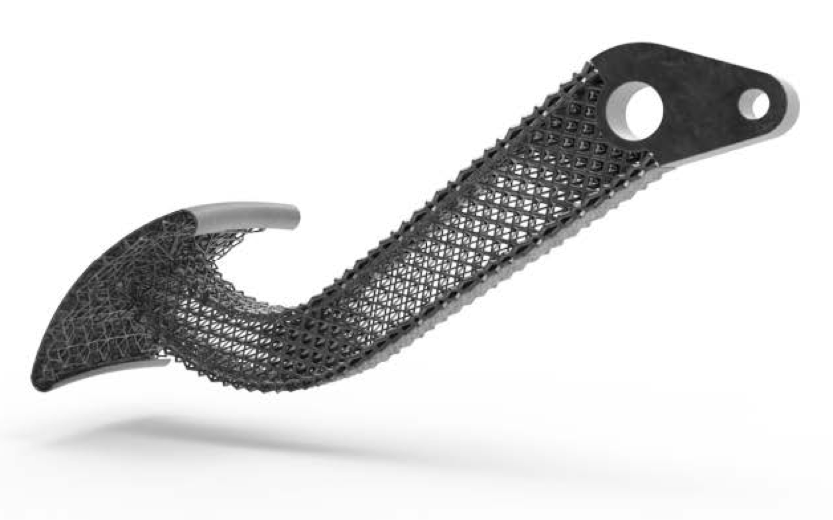
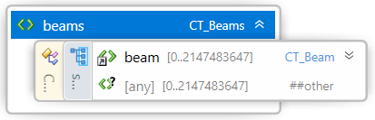
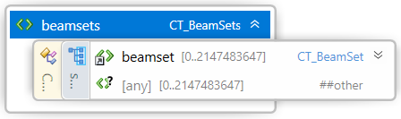
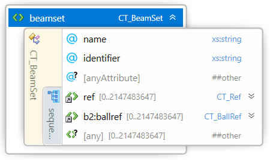

#  3MF Beam Lattice Extension

## Specification & Reference Guide


| **Version** | 1.2.0 |
| --- | --- |
| **Status** | Published |

## Disclaimer

THESE MATERIALS ARE PROVIDED "AS IS." The contributors expressly disclaim any warranties (express, implied, or otherwise), including implied warranties of merchantability, non-infringement, fitness for a particular purpose, or title, related to the materials. The entire risk as to implementing or otherwise using the materials is assumed by the implementer and user. IN NO EVENT WILL ANY MEMBER BE LIABLE TO ANY OTHER PARTY FOR LOST PROFITS OR ANY FORM OF INDIRECT, SPECIAL, INCIDENTAL, OR CONSEQUENTIAL DAMAGES OF ANY CHARACTER FROM ANY CAUSES OF ACTION OF ANY KIND WITH RESPECT TO THIS DELIVERABLE OR ITS GOVERNING AGREEMENT, WHETHER BASED ON BREACH OF CONTRACT, TORT (INCLUDING NEGLIGENCE), OR OTHERWISE, AND WHETHER OR NOT THE OTHER MEMBER HAS BEEN ADVISED OF THE POSSIBILITY OF SUCH DAMAGE.

## Table of Contents

- [Preface](#preface)
  * [About this Specification](#11-about-this-specification)
  * [Document Conventions](#document-conventions)
  * [Language Notes](#language-notes)
  * [Software Conformance](#software-conformance)
- [Part I: 3MF Documents](#part-i-3mf-documents)
- [Chapter 1. Overview of Additions](#chapter-1-overview-of-additions)
- [Chapter 2. Object](#chapter-2-object)
  * [2.1. Beamlattice](#11-beamlattice)
- [Part II. Appendixes](#part-ii-appendixes)
  * [Appendix A. Glossary](#appendix-a-glossary)
  * [Appendix B. 3MF XSD Schema](#appendix-b-3mf-xsd-schema)
  * [Appendix C. Standard Namespaces](#appendix-c-standard-namespaces)
  * [Appendix D: Example files](#appendix-d-example-files)
- [References](#references)

# Preface

## About this Specification

This 3MF beam lattice specification is an extension to the core 3MF specification. This document cannot stand alone and only applies as an addendum to the core 3MF specification. Usage of this and any other 3MF extensions follow an a la carte model, defined in the core 3MF specification.

Part I, "3MF Documents," presents the details of the primarily XML-based 3MF Document format. This section describes the XML markup that defines the composition of 3D documents and the appearance of each model within the document.

Part II, "Appendixes," contains additional technical details and schemas too extensive to include in the main body of the text as well as convenient reference information.

The information contained in this specification is subject to change. Every effort has been made to ensure its accuracy at the time of publication.

This extension MUST be used only with Core specification 1.x.

## Document Conventions

See [the 3MF Core Specification conventions](https://github.com/3MFConsortium/spec_core/blob/master/3MF%20Core%20Specification.md#document-conventions).

In this extension specification, as an example, the prefix "b" maps to the base xml-namespace "http://schemas.microsoft.com/3dmanufacturing/beamlattice/2017/02", as defined in version 1.1, and the prefix "b2" maps to the xml namespace  "http://schemas.microsoft.com/3dmanufacturing/beamlattice/balls/2020/07" defining balls. See [Appendix C. Standard Namespaces](#appendix-c-standard-namespaces).

## Language Notes

See [the 3MF Core Specification language notes](https://github.com/3MFConsortium/spec_core/blob/master/3MF%20Core%20Specification.md#language-notes).

## Software Conformance

See [the 3MF Core Specification software conformance](https://github.com/3MFConsortium/spec_core/blob/master/3MF%20Core%20Specification.md#software-conformance).

# Part I: 3MF Documents

# Chapter 1. Overview of Additions



This document describes new elements, each of which is OPTIONAL for producers, but MUST be supported by consumers that specify support for this beam lattice extension of 3MF.

The central idea of this extension is to enrich the geometry notion of 3MF with beam lattice elements that can represent small-scale lattices as well as larger truss structures – both of which are quite inefficient to handle with a mesh representation, especially in cases where the element count grows into large numbers.

In order to find a balance between implementation complexity and capabilities, in this version of the specification all lattice beams are required to have a circular cross section. This reduces anisotropy issues that would be introduced by non-rotational geometries. Any additional capabilities MAY be handled by further (either public or private) extensions.

While this is meant to be an exact specification of the lattice geometry, and consumers MUST interpret it as such, the intent is also for applications in which editors can use the data structures for efficient interoperability and post processing the geometry in an intermediate step.

This extension specification contains two schemas, one for the beam lattice elements and the other for ball elements.

A producer using the lattice specification MUST mark the "b" extension as required, as described in the core specification. A producer SHOULD also mark the additional "b2" namespace for balls within beam lattices as a required extension when the 3MF file contains beam lattices with balls. However, for backwards compatibility, the producer SHOULD not mark the "b2" as a required extension when the 3MF file does not contain beam lattices with balls. 

Please refer to the example 3MF file in [Appendix D: Example files](#appendix-d-example-files) for guidance on how to apply namespace prefixes appropriately to elements and attributes associated with this extension.

##### Figure 1-1: Overview of model XML structure of 3MF with beam lattice additions

#####


# Chapter 2. Object

Element **\<mesh>**


This 3MF extension specification defines a new \<beamlattice> element that lives as child of the \<mesh> element from the core 3MF specification, as the lattice structures are intended to be subject to the same coordinate system as the underlying mesh.  A beamlattice MUST only be added to a mesh object of type "model" or "solidsupport".

The positive fill rule (as defined in the Core Specification) MUST first be applied to the triangle mesh geometry and lattice geometry separately and independently. Then the triangle mesh geometry MUST be unified with the lattice geometry according to the positive fill rule (for the triangles). In case of an overlap, the properties of the triangle mesh geometry MUST prevail in the overlapping region.

If a beamlattice is added to a mesh object, the mesh MAY consist of no triangles. This allows the representation of lattice-only objects.

>**Note:** This is relaxing the rules of the core specification, but is not a breaking change, as the beamlattice extension MUST always be a required extension.

This implies that the geometric surface of the lattice MUST be transformed as the mesh itself, i.e. translated, rotated, scaled, mirrored and sheared as defined in the build items and components of the core specification. Should the beam lattice contain a clipping mesh or a representation mesh then any transform applied to the lattice MUST also be applied to these meshes.

## 2.1. Beamlattice

Element **\<beamlattice>**


| Name   | Type   | Use   | Default   | Annotation |
| --- | --- | --- | --- | --- |
| minlength | **ST\_PositiveNumber** | required |   | A producer MUST specify the minimal length of all beams in the lattice. The producer SHOULD NOT produce zero length beams (i.e. shorter than minlength). The consumer MUST ignore all beams with length shorter than minlength. |
| radius   | **ST\_PositiveNumber** | required |   | Default uniform radius value for the beams. |
| ballmode | **ST\_BallMode** | optional | none | Specifies whether balls are created at beam vertices. Possible values are:<br/>- **none** : No balls are created at beam vertices. <br/>- **mixed** : balls are created at vertices with a corresponding \<ball> element.  Other vertices do not get a ball. <br/>- **all** : balls are created at every vertex that maps to the end of a beam, using either ballradius or what is specified in a corresponding \<ball> element for that vertex, if present. |
| ballradius   | **ST\_PositiveNumber** | optional |   | Default uniform radius value for the balls. Required if ballmode is different to "none". |
| clippingmode | **ST\_ClippingMode** | optional | none | Specifies the clipping mode of the beam lattice. Possible values are:<br/>- **none** : The lattice is not clipped at any mesh boundary.<br/>- **inside** : The lattice is clipped by the volume described by the referenced clippingmesh. All geometry inside the volume (according to the positive fill rule) is retained.<br/>- **outside** : The lattice is clipped by the volume described by the referenced clippingmesh. All geometry outside the volume (according to the positive fill rule) is retained.<br/>If clipping mode is not equal to "none", a clippingmesh resource MUST be specified. |
| clippingmesh   | **ST\_ResourceID** | optional   |   | Required, if clippingmode is different to "none". The clippingmesh attribute MUST reference an object id earlier in the file. The object MUST be a mesh object of type "model" (i.e. not a components object), and MUST NOT contain a beamlattice. The clippingmesh id MUST NOT be a self-reference (i.e. the id references the object that contains the beam lattice). |
| representationmesh | **ST\_ResourceID** | optional  |   | References a mesh object that represents the intentional shape of the lattice geometry. It is up to the producer to decide the appropriate level of fidelity of the geometry. The consumer MAY use this for display and preview purposes and MUST NOT use it for manufacturing the part.<br>The object MUST be a mesh object of type "model" (i.e. not a components object) and MUST NOT contain a beamlattice. The representationmesh id MUST NOT be a self-reference (i.e. the id references the object that contains the beam lattice). The representationmesh attribute MUST reference an object id earlier in the file. |
| pid | **ST\_ResourceID** | optional |   | Overrides the object-level pid as default for all beams. |
| pindex | **ST\_ResourceIndex** | optional |   | Overrides the object-level pindex as default for all beams. |
| cap   | **ST\_CapMode** | optional | sphere   | Default capping mode for beam ends (see below). Possible values:<br/>- "hemisphere": the beam end will be closed at its end nodes by a half sphere.<br/>- "sphere": the beam end will be closed at its end nodes by a sphere.<br/>- "butt": the beam end will be closed with a flat end and therefore have a cylindrical or conical shape. |

A _beam lattice node_ provides information about _lattice_ data, in the form of a simplistic node-beam model as part of the mesh.

A \<beamlattice> element acts as a container for beams, balls and beam sets. The lattice MAY be geometrically clipped against a reference mesh as defined by the clippingmode and clippingmesh attributes. The clipping mode determines which parts of the lattice define the final geometry. Consumers MUST clip the beam lattice when a clippingmesh is provided and the clippingmode is not equal to "none".  The clipped surfaces of the lattice MUST inherit any properties (for example, color) from the clippingmesh.

If this beam lattice contains any beam or ball with assigned properties, the beam lattice or object MUST specify pid and pindex, to act as default values for any beam or ball with unspecified properties.

##### Figure 2-1: Example images of clipping modes of a lattice against a sphere mesh


The lattice is to be clipped against a spherical clippingmesh.

|  |  |  |
| :---: | :---: | :---: |
| Clippingmode "none" leaves the lattice unchanged. | Clippingmode "inside" constrains the lattice to the inside of the sphere.  | Clippingmode "outside" constrains the lattice to the outside of the sphere. |

### 2.1.1. Beams

Element **\<beams>**



A _beam lattice node_ contains a _beams node_ that contains all the beam data.

A \<beams> element acts as a container for beams. The order of these elements forms an implicit 0-based index that can be referenced by metadata. A beams element MUST NOT contain more than 2^31-1 beams.

#### 2.1.1.1. Beam elements

Element **\<beam>**


| Name   | Type   | Use   | Default   | Annotation |
| --- | --- | --- | --- | --- |
| v1   | **ST\_ResourceIndex**   | required   |   | References a zero-based index into the vertices of this mesh. Defines the first vertex of the beam. |
| v2   | **ST\_ResourceIndex** | required   |   | References a zero-based index into the vertices of this mesh. Defines the second vertex of the beam. |
| r1   | **ST\_PositiveNumber**   | optional   |   | Defines the radius of the first vertex of beam. If not given, the value defaults to the radius value of the beamlattice. |
| r2   | **ST\_PositiveNumber**   | optional   |   | Defines the radius of the second vertex of the beam. MUST not be defined, if r1 is not defined.If r2 is not defined, the value defaults to the value of r1. If not given, the value defaults to the radius value of the beamlattice. |
| p1 | **ST\_ResourceIndex** | optional |   | Overrides the beamlattice-level pindex for the first vertex of the beam. |
| p2 | **ST\_ResourceIndex** | optional |   | Overrides the beamlattice-level pindex for the second vertex of the beam. |
| pid | **ST\_ResourceID** | optional |   | Overrides the beamlattice-level pid for the beam. |
| cap1   | **ST\_CapMode** | optional |   | Capping mode for the end of the beam (see below). Possible values:<br/>- "hemisphere": the beam end will be closed at its end nodes by a half sphere.<br/>- "sphere": the beam end will be closed at its end nodes by a sphere.<br/>- "butt": the beam end will be closed with a flat end and therefore have a cylindrical or conical shape.<br/>If no cap is given, defaults to the beamlattice cap mode. |
| cap2 | **ST\_CapMode** | optional |   | Capping mode for the end of the beam (see below). Possible values:<br/>- "hemisphere": the beam end will be closed at its end nodes by a half sphere.<br/>- "sphere": the beam end will be closed at its end nodes by a sphere.<br/>- "butt": the beam end will be closed with a flat end and therefore have a cylindrical or conical shape.<br/>If no cap is given, defaults to the beamlattice cap mode. |

Lattice beams are attached to standard vertex elements of the mesh object. This allows an exact connectivity of them to the surface on the one hand, and gives a central location for all spatial properties of a single mesh. Furthermore, the transform behavior plugs into the standard way of mesh transformations and components as defined in the core specification.

>**Note:** This might lead to vertex elements in the 3MF that are not part of the mesh surface.

A beam element represents a single beam of the beamlattice. A beam follows a line with two attached radii at the ends, which are interpolated linearly over the line. A beam MUST consist of two distinct vertex indices, and SHOULD have a minimum distance of the lattice's minlength (in the local coordinate system, before applying any transform).

|  |  |
| --- | --- |

The beam geometry is given by a conical frustum. If a ball is defined at the end vertex, the beam's end geometry is given by the union of the ball and the cap geometry, as defined by the capmode.

- If the capmode is "butt", the frustum is kept with flat ends.
- If the capmode is "sphere", the frustum is capped with spheres of specified radii.
- If the capmode is "hemisphere", the frustum is capped with half spheres of specified radii.

|  |  |  |
| :---: | :---: | :---: |
| capmode "butt" | capmode "sphere" | capmode "hemisphere" |

A beam MAY combine two different capmodes on either vertex.

>**Note** : In case of cylinders (i.e. both radii of a beam are equal), the notion of sphere and hemisphere leads to the same geometry.

The unification of all beam and ball geometries of a beamlattice and the triangle mesh will give a well-defined lattice geometry. To guarantee this, all beams MUST be capped prior to the unification process.

Within the beamlattice, the surface properties of the geometry will be given by the unification of the surface properties of the beam elements. In the case of overlapping surface regions, the last beam MUST prevail, analogous to the corresponding overlapping rules of the core specification.


The beam radii can be given by a variety of combinations. These MUST be interpreted in the following order:

- If both radii are given, they determine the geometry.
- If only r1 is given, the beam will be cylindrical with radius r1.
- If no radius is given, the beam will be cylindrical with the radius defined in the beamlattice.

Property values MUST be applied over the axial line as they would be applied over the triangles of the mesh. See the core specification and materials extension for details and restrictions. The property values shall extend from the line to the surface of the beam geometry by applying the nearest neighbor on the line. In the unification process of the beams, ambiguities of the corresponding surface properties are likely to occur. In this case, the property of the last beam in the beamlattice order MUST be used, consistent with the core specification.

|  |  | |
| --- | --- | --- |
| _Properties applied to nodes_ | _Properties applied to line_ | _Properties extended to beam surface_ |

>**Note:** Properties MUST be applied in the local coordinate system, before applying any transform.

>**Note:** Properties defined on a beam that are from a display properties group MUST NOT form gradients, as interpolation between physically based materials is not defined in the core specification. A consumer MUST apply the p1 property to the entire beam. Property p2 MUST be either unspecified or MUST be equal to p1.

### 2.1.2. Balls
Element **\<balls>**


A _beam lattice node_ can contain a _balls node_ that contains spheres around vertices at beam ends. This allows, for example, dumbbell shaped beams and rod and ball lattices.

A \<balls> element acts as a container for ball elements. The order of these elements forms an implicit 0-based index that can be referenced by metadata. A balls element MUST contain at least one ball element and MUST NOT contain more than 2^31-1 ball elements.

### 2.1.2.1 Ball
Element **\<ball>**


| Name   | Type   | Use   | Default   | Annotation |
| --- | --- | --- | --- | --- |
| vindex   | **ST\_ResourceIndex** | required |    | References a zero-based index into the vertices of this mesh. Defines the vertex that serves as the center for this ball. |
| r   | **ST\_PositiveNumber** | optional |    | The radius of this ball. |
| p | **ST\_ResourceIndex** | optional |   | Overrides the beamlattice-level pindex for this ball. |
| pid | **ST\_ResourceID** | optional |   | Overrides the beamlattice-level pid for this ball. |

The _ball element_ defines a sphere of a given radius centered at the position of the vertex defined by "vindex".  The vertex defined by "vindex" MUST be the end vertex of at least one beam.

If the attribute "r" is not given, the default "ballradius" of the enclosing beamlattice MUST be used as the radius of the ball. 


Property values MUST be applied over the sphere as they would be applied over the triangles of the mesh. See the core specification and materials extension for details and restrictions.

In the unification process of the beams and balls, ambiguities of the corresponding surface properties are likely to occur. In the case that the unification process contains only balls and there are ambiguities, the property of the last ball in the beam lattice MUST be used, consistent with the core specification. If the unification process involved beams and there are ambiguities, the property of the last beam in the beamlattice order MUST be used, consistent with the core specification.

### 2.1.3. Beamsets

Element **\<beamsets>**



A _beam lattice node_ MAY contain a _beamsets node_ that contains information how beams are grouped and organized.

A \<beamsets> element acts as a container for beamset nodes. The order of these elements forms an implicit 0-based index that MAY be referenced externally by their identifier.

### 2.1.4. Beam Set-Elements

Element **\<beamset>**



| Name   | Type   | Use   | Default   | Annotation |
| --- | --- | --- | --- | --- |
| name   | **ST\_String**   | optional   |   | Human-readable name of the beam collection |
| identifier | **ST\_String** | optional |   | Might be used for external identification of the beam collection data. The identifier attribute MUST be unique within the beam lattice. |

A _beam set_ contains a reference list to a subset of beams and a reference list to a subset of balls to apply grouping operations and assign properties to a list of beams. Editing applications might use this information for internal purposes, for example color display and selection workflows.

A beamset is a collection of references to beams and balls. Since beamsets do not have a specific influence on the geometrical shape, a consumer MAY ignore the information.

A consumer MUST ignore duplicate references to the same beam or ball in one set. A producer SHOULD avoid creating duplicate references to the same beam or ball in one set.

#### 2.1.4.1. Beam Set References

Element **\<ref>**


| Name   | Type   | Use   | Default   | Annotation |
| --- | --- | --- | --- | --- |
| index   | **ST\_ResourceIndex**   | required   |   | References an index in the beamlattice beam list. |

A \<ref> element in a beam set refers to the zero-based indexed \<beam> elements that are contained in the _beamlattice node._


#### 2.1.4.2. Ball References

Element **\<ballref>**


| Name   | Type   | Use   | Default   | Annotation |
| --- | --- | --- | --- | --- |
| index   | **ST\_ResourceIndex**   | required   |   | References an index in the beamlattice ball list. |

A \<ballref> element in a beam set refers to the zero-based indexed \<ball> elements that are contained in the _beamlattice node._


# Part II. Appendixes

## Appendix A. Glossary

See [the 3MF Core Specification glossary](https://github.com/3MFConsortium/spec_core/blob/master/3MF%20Core%20Specification.md#appendix-a-glossary).

## Appendix B. 3MF XSD Schema

### A.1. Beam lattice schema

```xml
<?xml version="1.0" encoding="UTF-8"?>
<xs:schema xmlns="http://schemas.microsoft.com/3dmanufacturing/beamlattice/2017/02"
  xmlns:xs="http://www.w3.org/2001/XMLSchema" xmlns:xml="http://www.w3.org/XML/1998/namespace"
  targetNamespace="http://schemas.microsoft.com/3dmanufacturing/beamlattice/2017/02"
  elementFormDefault="unqualified" attributeFormDefault="unqualified" blockDefault="#all">
  <xs:import namespace="http://www.w3.org/XML/1998/namespace" schemaLocation="http://www.w3.org/2001/xml.xsd"/>
  <xs:annotation>
    <xs:documentation>
      <![CDATA[
    Schema notes:
 
    Items within this schema follow a simple naming convention of appending a prefix indicating the type of element for references:
 
    Unprefixed: Element names
    CT_: Complex types
    ST_: Simple types
   
    ]]>
    </xs:documentation>
  </xs:annotation>
  <!-- Complex Types -->
  <xs:complexType name="CT_Mesh">
    <xs:sequence>
      <xs:any namespace="##other" processContents="lax" minOccurs="0" maxOccurs="2147483647"/>
      <xs:element ref="beamlattice" minOccurs="0" maxOccurs="1"/>
    </xs:sequence>
  </xs:complexType>
  <xs:complexType name="CT_BeamLattice">
    <xs:sequence>
       <xs:element ref="beams"/>
       <xs:element ref="beamsets" minOccurs="0" maxOccurs="1"/>
       <xs:any namespace="##other" processContents="lax" minOccurs="0" maxOccurs="2147483647"/> 
    </xs:sequence>
    <xs:attribute name="minlength" type="ST_PositiveNumber" use="required"/>
    <xs:attribute name="radius" type="ST_PositiveNumber" use="required"/>
    <xs:attribute name="clippingmode" type="ST_ClippingMode" default="none"/>
    <xs:attribute name="clippingmesh" type="ST_ResourceID" />
    <xs:attribute name="representationmesh" type="ST_ResourceID" />
    <xs:attribute name="pid" type="ST_ResourceID" />
    <xs:attribute name="pindex" type="ST_ResourceIndex" />
    <xs:attribute name="cap" type="ST_CapMode" />
    <xs:anyAttribute namespace="##other" processContents="lax"/>
  </xs:complexType>
   <xs:complexType name="CT_Beam">
     <xs:sequence>
       <xs:any namespace="##other" processContents="lax" minOccurs="0" maxOccurs="2147483647"/>
     </xs:sequence>
    <xs:attribute name="v1" type="ST_ResourceIndex" use="required" />
    <xs:attribute name="v2" type="ST_ResourceIndex" use="required" />
    <xs:attribute name="r1" type="ST_PositiveNumber" />
    <xs:attribute name="r2" type="ST_PositiveNumber" />
    <xs:attribute name="p1" type="ST_ResourceIndex" />
    <xs:attribute name="p2" type="ST_ResourceIndex" />
    <xs:attribute name="pid" type="ST_ResourceID" />
    <xs:attribute name="cap1" type="ST_CapMode" />
    <xs:attribute name="cap2" type="ST_CapMode" />
    <xs:anyAttribute namespace="##other" processContents="lax"/>
   </xs:complexType>
  <xs:complexType name="CT_Beams">
      <xs:sequence>
        <xs:element ref="beam" minOccurs="0" maxOccurs="2147483647"/>
        <xs:any namespace="##other" processContents="lax" minOccurs="0" maxOccurs="2147483647"/>
      </xs:sequence>
  </xs:complexType>
  <xs:complexType name="CT_BeamSet">
    <xs:sequence>
      <xs:element ref="ref" minOccurs="0" maxOccurs="2147483647"/>
      <xs:any namespace="##other" processContents="lax" minOccurs="0" maxOccurs="2147483647"/> 
    </xs:sequence>
    <xs:attribute name="name" type="xs:string"/>
    <xs:attribute name="identifier" type="xs:string"/>
    <xs:anyAttribute namespace="##other" processContents="lax"/>
  </xs:complexType>
  <xs:complexType name="CT_BeamSets">
    <xs:sequence>
      <xs:element ref="beamset" minOccurs="0" maxOccurs="2147483647"/>
      <xs:any namespace="##other" processContents="lax" minOccurs="0" maxOccurs="2147483647"/> 
    </xs:sequence>
  </xs:complexType>
  <xs:complexType name="CT_Ref">
    <xs:sequence>
      <xs:any namespace="##other" processContents="lax" minOccurs="0" maxOccurs="2147483647"/>
    </xs:sequence>
    <xs:attribute name="index" type="ST_ResourceIndex" use="required"/>
    <xs:anyAttribute namespace="##other" processContents="lax"/>
  </xs:complexType>
  <!-- Simple Types -->
  <xs:simpleType name="ST_ClippingMode">
    <xs:restriction base="xs:string">
      <xs:enumeration value="none"/>
      <xs:enumeration value="inside"/>
      <xs:enumeration value="outside"/>
    </xs:restriction>
  </xs:simpleType>
  <xs:simpleType name="ST_CapMode">
    <xs:restriction base="xs:string">
      <xs:enumeration value="hemisphere"/>
      <xs:enumeration value="sphere"/>
      <xs:enumeration value="butt"/>
    </xs:restriction>
  </xs:simpleType>
  <xs:simpleType name="ST_ResourceID">
    <xs:restriction base="xs:positiveInteger">
      <xs:maxExclusive value="2147483648"/>
    </xs:restriction>
  </xs:simpleType>
  <xs:simpleType name="ST_PositiveNumber">
    <xs:restriction base="xs:double">
      <xs:whiteSpace value="collapse"/>
      <xs:pattern value="((\+)?(([0-9]+(\.[0-9]+)?)|(\.[0-9]+))((e|E)(\-|\+)?[0-9]+)?)"/>
    </xs:restriction>
  </xs:simpleType>
  <xs:simpleType name="ST_ResourceIndex">
    <xs:restriction base="xs:nonNegativeInteger">
      <xs:maxExclusive value="2147483648"/>
    </xs:restriction>
  </xs:simpleType>
  <!-- Elements -->
  <xs:element name="beam" type="CT_Beam"/>
  <xs:element name="beams" type="CT_Beams"/>
  <xs:element name="ref" type="CT_Ref"/>
  <xs:element name="beamset" type="CT_BeamSet"/>
  <xs:element name="beamsets" type="CT_BeamSets"/>
  <xs:element name="beamlattice" type="CT_BeamLattice"/>
</xs:schema>
```
### A.2. Balls schema within beam lattices

```xml
<?xml version="1.0" encoding="UTF-8"?>
<xs:schema xmlns="http://schemas.microsoft.com/3dmanufacturing/beamlattice/balls/2020/07"
  xmlns:xs="http://www.w3.org/2001/XMLSchema" xmlns:xml="http://www.w3.org/XML/1998/namespace"
  targetNamespace="http://schemas.microsoft.com/3dmanufacturing/beamlattice/balls/2020/07"
  elementFormDefault="unqualified" attributeFormDefault="unqualified" blockDefault="#all">
  <xs:import namespace="http://www.w3.org/XML/1998/namespace" schemaLocation="http://www.w3.org/2001/xml.xsd"/>
  <xs:annotation>
    <xs:documentation>
      <![CDATA[
    Schema notes:
 
    Items within this schema follow a simple naming convention of appending a prefix indicating the type of element for references:
 
    Unprefixed: Element names
    CT_: Complex types
    ST_: Simple types
   
    ]]>
    </xs:documentation>
  </xs:annotation>
  <!-- Complex Types -->
  <xs:complexType name="CT_BeamLattice">
    <xs:sequence>
       <xs:element ref="balls" minOccurs="0" maxOccurs="1"/>
    </xs:sequence>
    <xs:attribute name="ballmode" type="ST_BallMode" default="none"/>
    <xs:attribute name="ballradius" type="ST_PositiveNumber"/>
    <xs:anyAttribute namespace="##other" processContents="lax"/>
  </xs:complexType>
  <xs:complexType name="CT_Ball">
     <xs:sequence>
       <xs:any namespace="##other" processContents="lax" minOccurs="0" maxOccurs="2147483647"/>
     </xs:sequence>
    <xs:attribute name="vindex" type="ST_ResourceIndex" use="required" />
    <xs:attribute name="r" type="ST_PositiveNumber" />
    <xs:attribute name="p" type="ST_ResourceIndex" />
    <xs:attribute name="pid" type="ST_ResourceID" />
    <xs:anyAttribute namespace="##other" processContents="lax"/>
  </xs:complexType>
  <xs:complexType name="CT_Balls">
      <xs:sequence>
        <xs:element ref="ball" minOccurs="1" maxOccurs="2147483647"/>
        <xs:any namespace="##other" processContents="lax" minOccurs="0" maxOccurs="2147483647"/>
      </xs:sequence>
  </xs:complexType>
  <xs:complexType name="CT_BallRef">
    <xs:sequence>
      <xs:any namespace="##other" processContents="lax" minOccurs="0" maxOccurs="2147483647"/>
    </xs:sequence>
    <xs:attribute name="index" type="ST_ResourceIndex" use="required"/>
    <xs:anyAttribute namespace="##other" processContents="lax"/>
  </xs:complexType>
  <xs:complexType name="CT_BeamSet">
    <xs:sequence>
      <xs:element ref="ballref" minOccurs="0" maxOccurs="2147483647"/>	
    </xs:sequence>
    <xs:anyAttribute namespace="##other" processContents="lax"/>
  </xs:complexType>  
  <!-- Simple Types -->
  <xs:simpleType name="ST_BallMode">
    <xs:restriction base="xs:string">
      <xs:enumeration value="none"/>
      <xs:enumeration value="mixed"/>
      <xs:enumeration value="all"/>
    </xs:restriction>
  </xs:simpleType>
  <xs:simpleType name="ST_ResourceID">
    <xs:restriction base="xs:positiveInteger">
      <xs:maxExclusive value="2147483648"/>
    </xs:restriction>
  </xs:simpleType>
  <xs:simpleType name="ST_PositiveNumber">
    <xs:restriction base="xs:double">
      <xs:whiteSpace value="collapse"/>
      <xs:pattern value="((\+)?(([0-9]+(\.[0-9]+)?)|(\.[0-9]+))((e|E)(\-|\+)?[0-9]+)?)"/>
    </xs:restriction>
  </xs:simpleType>
  <xs:simpleType name="ST_ResourceIndex">
    <xs:restriction base="xs:nonNegativeInteger">
      <xs:maxExclusive value="2147483648"/>
    </xs:restriction>
  </xs:simpleType>
  <!-- Elements -->  
  <xs:element name="ball" type="CT_Ball"/>
  <xs:element name="balls" type="CT_Balls"/>
  <xs:element name="beamset" type="CT_BeamSet"/>
  <xs:element name="ballref" type="CT_BallRef"/>
  <xs:element name="beamlattice" type="CT_BeamLattice"/>
</xs:schema>
```

## Appendix C. Standard Namespaces

BeamLattice    [http://schemas.microsoft.com/3dmanufacturing/beamlattice/2017/02](http://schemas.microsoft.com/3dmanufacturing/beamlattice/2017/02)

BallsWithinBeamLattice [http://schemas.microsoft.com/3dmanufacturing/beamlattice/balls/2020/07](http://schemas.microsoft.com/3dmanufacturing/beamlattice/balls/2020/07)

## Appendix D: Example files

### D.1. Beam lattices example

```xml
<?xml version="1.0" encoding="utf-8"?>
<model xmlns="http://schemas.microsoft.com/3dmanufacturing/core/2015/02" unit="millimeter"
    xmlns:b="http://schemas.microsoft.com/3dmanufacturing/beamlattice/2017/02"
    xmlns:b2="http://schemas.microsoft.com/3dmanufacturing/beamlattice/balls/2020/07"
    requiredextensions="b">
    <resources>
        <object id="1" name="Box" partnumber="e1ef01d4-cbd4-4a62-86b6-9634e2ca198b" type="model">
            <mesh>
                <vertices>
                    <vertex x="45.00000" y="55.00000" z="55.00000"/>
                    <vertex x="45.00000" y="45.00000" z="55.00000"/>
                    <vertex x="45.00000" y="55.00000" z="45.00000"/>
                    <vertex x="45.00000" y="45.00000" z="45.00000"/>
                    <vertex x="55.00000" y="55.00000" z="45.00000"/>
                    <vertex x="55.00000" y="55.00000" z="55.00000"/>
                    <vertex x="55.00000" y="45.00000" z="55.00000"/>
                    <vertex x="55.00000" y="45.00000" z="45.00000"/>
                </vertices>
                <b:beamlattice radius="1" minlength="0.0001" cap="sphere">
                    <b:beams>
                        <b:beam v1="0" v2="1" r1="1.50000" r2="1.60000"/>
                        <b:beam v1="2" v2="0" r1="3.00000" r2="1.50000"/>
                        <b:beam v1="1" v2="3" r1="1.60000" r2="3.00000"/>
                        <b:beam v1="3" v2="2" r1="3.00000"/>
                        <b:beam v1="2" v2="4" r1="3.00000" r2="2.00000"/>
                        <b:beam v1="4" v2="5" r1="2.00000"/>
                        <b:beam v1="5" v2="6" r1="2.00000"/>
                        <b:beam v1="7" v2="6" r1="2.00000"/>
                        <b:beam v1="1" v2="6" r1="1.60000" r2="2.00000"/>
                        <b:beam v1="7" v2="4" r1="2.00000"/>
                        <b:beam v1="7" v2="3" r1="2.00000" r2="3.00000"/>
                        <b:beam v1="0" v2="5" r1="1.50000" r2="2.00000"/>
                    </b:beams>
                </b:beamlattice>
            </mesh>
        </object>
    </resources>
    <build>
        <item objectid="1"/>
    </build>
</model>
```

### D.2. Beam lattices with balls example

```xml
<?xml version="1.0" encoding="utf-8"?>
<model xmlns="http://schemas.microsoft.com/3dmanufacturing/core/2015/02" unit="millimeter"
    xmlns:b="http://schemas.microsoft.com/3dmanufacturing/beamlattice/2017/02"
    xmlns:b2="http://schemas.microsoft.com/3dmanufacturing/beamlattice/balls/2020/07"
    requiredextensions="b b2">
    <resources>
        <object id="1" name="Box" partnumber="e1ef01d4-cbd4-4a62-86b6-9634e2ca198b" type="model">
            <mesh>
                <vertices>
                    <vertex x="45.00000" y="55.00000" z="55.00000"/>
                    <vertex x="45.00000" y="45.00000" z="55.00000"/>
                    <vertex x="45.00000" y="55.00000" z="45.00000"/>
                    <vertex x="45.00000" y="45.00000" z="45.00000"/>
                    <vertex x="55.00000" y="55.00000" z="45.00000"/>
                    <vertex x="55.00000" y="55.00000" z="55.00000"/>
                    <vertex x="55.00000" y="45.00000" z="55.00000"/>
                    <vertex x="55.00000" y="45.00000" z="45.00000"/>
                </vertices>
                <b:beamlattice radius="1" minlength="0.0001" cap="sphere" b2:ballmode="mixed" b2:ballradius="0.25">
                    <b:beams>
                        <b:beam v1="0" v2="1" r1="1.50000" r2="1.60000"/>
                        <b:beam v1="2" v2="0" r1="3.00000" r2="1.50000"/>
                        <b:beam v1="1" v2="3" r1="1.60000" r2="3.00000"/>
                        <b:beam v1="3" v2="2" r1="3.00000"/>
                        <b:beam v1="2" v2="4" r1="3.00000" r2="2.00000"/>
                        <b:beam v1="4" v2="5" r1="2.00000"/>
                        <b:beam v1="5" v2="6" r1="2.00000"/>
                        <b:beam v1="7" v2="6" r1="2.00000"/>
                        <b:beam v1="1" v2="6" r1="1.60000" r2="2.00000"/>
                        <b:beam v1="7" v2="4" r1="2.00000"/>
                        <b:beam v1="7" v2="3" r1="2.00000" r2="3.00000"/>
                        <b:beam v1="0" v2="5" r1="1.50000" r2="2.00000"/>
                    </b:beams>
                    <b2:balls>
                        <b2:ball vindex="0" r=".50"/>
                        <b2:ball vindex="5"/>
                        <b2:ball vindex="7" r=".50"/>
                    </bs:balls>
                </b:beamlattice>
            </mesh>
        </object>
    </resources>
    <build>
        <item objectid="1"/>
    </build>
</model>
```

# References

See [the 3MF Core Specification references](https://github.com/3MFConsortium/spec_core/blob/master/3MF%20Core%20Specification.md#references).

Copyright 3MF Consortium 2018.
