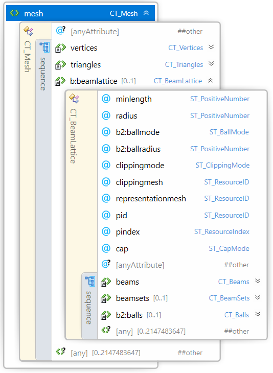
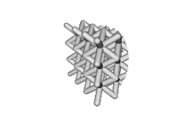

#  3MF Beam Lattice Extension

## Specification & Reference Guide


| **Version** | 1.02 |
| --- | --- |
| **Status** | Published |

## Disclaimer

THESE MATERIALS ARE PROVIDED "AS IS." The contributors expressly disclaim any warranties (express, implied, or otherwise), including implied warranties of merchantability, non-infringement, fitness for a particular purpose, or title, related to the materials. The entire risk as to implementing or otherwise using the materials is assumed by the implementer and user. IN NO EVENT WILL ANY MEMBER BE LIABLE TO ANY OTHER PARTY FOR LOST PROFITS OR ANY FORM OF INDIRECT, SPECIAL, INCIDENTAL, OR CONSEQUENTIAL DAMAGES OF ANY CHARACTER FROM ANY CAUSES OF ACTION OF ANY KIND WITH RESPECT TO THIS DELIVERABLE OR ITS GOVERNING AGREEMENT, WHETHER BASED ON BREACH OF CONTRACT, TORT (INCLUDING NEGLIGENCE), OR OTHERWISE, AND WHETHER OR NOT THE OTHER MEMBER HAS BEEN ADVISED OF THE POSSIBILITY OF SUCH DAMAGE.

## Table of Contents

[Preface](#preface)

[About this Specification](#11-about-this-specification)

[Document Conventions](#12-document-conventions)

[Language Notes](#13-language-notes)

[Software Conformance](#14-software-conformance)

[Part I: 3MF Documents](#part-i-3mf-documents)

[Chapter 1. Overview of Additions](#chapter-1-overview-of-additions)

[Chapter 2. Object](#chapter-2-object)

[2.1.        Beamlattice](#11-beamlattice)

[2.1.1.        Beams](#111-beams)

[2.1.2.        Beamsets](#112-beamsets)

[2.1.3.        Beam Set-Elements](#113-beam-set-elements)

[Part II. Appendixes](#part-ii-appendixes)

[Appendix A. Glossary](#appendix-a-glossary)

[Appendix B. 3MF XSD Schema](#appendix-b-3mf-xsd-schema)

[Appendix C. Standard Namespace](#appendix-c-standard-namespace)

[Appendix D: Example file](#appendix-d-example-file)

[References](#references)


# Preface

## 1.1. About this Specification

This 3MF beam lattice specification is an extension to the core 3MF specification. This document cannot stand alone and only applies as an addendum to the core 3MF specification. Usage of this and any other 3MF extensions follow an a la carte model, defined in the core 3MF specification.

Part I, "3MF Documents," presents the details of the primarily XML-based 3MF Document format. This section describes the XML markup that defines the composition of 3D documents and the appearance of each model within the document.

Part II, "Appendixes," contains additional technical details and schemas too extensive to include in the main body of the text as well as convenient reference information.

The information contained in this specification is subject to change. Every effort has been made to ensure its accuracy at the time of publication.

This extension MUST be used only with Core specification 1.x.

## 1.2. Document Conventions

Except where otherwise noted, syntax descriptions are expressed in the ABNF format as defined in RFC 4234.

Glossary terms are formatted like _this_.

Syntax descriptions and code are formatted in `monospace` type.

Replaceable items, that is, an item intended to be replaced by a value, are formatted in _`monospace cursive`_ type.

Notes are formatted as follows:

>**Note:** This is a note.

## 1.3. Language Notes

In this specification, the words that are used to define the significance of each requirement are written in uppercase. These words are used in accordance with their definitions in RFC 2119, and their respective meanings are reproduced below:

- _MUST._ This word, or the adjective "REQUIRED" means that the item is an absolute requirement of the specification.
- _SHOULD._ This word, or the adjective "RECOMMENDED" means that there may exist valid reasons in particular circumstances to ignore this item, but the full implications should be understood and the case carefully weighed before choosing a different course.
- _MAY._ This word, or the adjective "OPTIONAL" means that this item is truly optional. For example, one implementation may choose to include the item because a particular marketplace or scenario requires it or because it enhances the product. Another implementation may omit the same item.

## 1.4. Software Conformance

Most requirements are expressed as format or package requirements rather than implementation requirements.

In order for consumers to be considered conformant, they must observe the following rules:

- They MUST NOT report errors when processing conforming instances of the document format except when forced to do so by resource exhaustion.
- They SHOULD report errors when processing non-conforming instances of the document format when doing so does not pose an undue processing or performance burden.

In order for producers to be considered conformant, they must observe the following rules:

- They MUST NOT generate any new, non-conforming instances of the document format.
- They MUST NOT introduce any non-conformance when modifying an instance of the document format.

Editing applications are subject to all of the above rules.


# Part I: 3MF Documents

# Chapter 1. Overview of Additions


This document describes new elements, each of which is OPTIONAL for producers, but MUST be supported by consumers that specify support for this beam lattice extension of 3MF.

The central idea of this extension is to enrich the geometry notion of 3MF with beam lattice elements that can represent small-scale lattices as well as larger truss structures – both of which are quite inefficient to handle with a mesh representation, especially in cases where the element count grows into large numbers.

In order to find a balance between implementation complexity and capabilities, in this version of the specification all lattice beams are required to have a circular cross section. This reduces anisotropy issues that would be introduced by non-rotational geometries. Any additional capabilities MAY be handled by further (either public or private) extensions.

While this is meant to be an exact specification of the lattice geometry, and consumers MUST interpret it as such, the intent is also for applications in which editors can use the data structures for efficient interoperability and post processing the geometry in an intermediate step.

A producer using the lattice specification MUST mark the extension as required, as described in the core specification.

##### Figure 2-1: Overview of model XML structure of 3MF with beam lattice additions

#####


# Chapter 2. Object

Element **\<mesh>**


This 3MF extension specification defines a new \<beamlattice> element that lives as child of the \<mesh> element from the core 3MF specification, as the lattice structures are intended to be subject to the same coordinate system as the underlying mesh.  A beamlattice MUST only be added to a mesh object of type "model" or "solidsupport".

The triangle mesh geometry MUST be unified with the lattice geometry according to the positive fill rule (for the triangles). In case of an overlap, the properties of the triangle mesh geometry MUST prevail in the overlapping region.

If a beamlattice is added to a mesh object, the mesh MAY consist of no triangles. This allows the representation of lattice-only objects.

>**Note:** This is relaxing the rules of the core specification, but is not a breaking change, as the beamlattice extension MUST always be a required extension.

This implies that the geometric surface of the lattice MUST be transformed as the mesh itself, i.e. translated, rotated, scaled and sheared as defined in the build items and components of the core specification.

>**Note:** The corresponding rules for mirroring are applied implicitly.

## 1.1. Beamlattice

Element **\<beamlattice>**


| Name   | Type   | Use   | Default   | Annotation |
| --- | --- | --- | --- | --- |
| minlength | **ST\_PositiveNumber** | required |   | A producer MUST specify the minimal length of all beams in the lattice. The producer MUST NOT produce zero length beams (i.e. shorter than minlength). The consumer MUST ignore all beams with length shorter than minlength. |
| radius   | **ST\_PositiveNumber** | required |   | Default uniform radius value for the beams. |
| clippingmode | **ST\_ClippingMode** | optional | none | Specifies the clipping mode of the beam lattice. Possible values are:<br/>- **none** : The lattice is not clipped at any mesh boundary.<br/>- **inside** : The lattice is clipped by the volume described by the referenced clippingmesh. All geometry inside the volume (according to the positive fill rule) is retained.<br/>- **outside** : The lattice is clipped by the volume described by the referenced clippingmesh. All geometry outside the volume (according to the positive fill rule) is retained.<br/>If clipping mode is not equal to "none", a clippingmesh resource MUST be specified. |
| clippingmesh   | **ST\_ResourceID** | optional   |   | Required, if clippingmode is different to "none". The clippingmesh attribute MUST reference an object id earlier in the file. The object MUST be a mesh object of type "model" (i.e. not a components object), and MUST NOT contain a beamlattice. The clippingmesh id MUST NOT be a self-reference (i.e. the id references the object that contains the beam lattice). |
| representationmesh | **ST\_ResourceID** | optional  |   | References a mesh object that represents the intentional shape of the lattice geometry. It is up to the producer to decide the appropriate level of fidelity of the geometry. The consumer MAY use this for display and preview purposes and MUST NOT use it for manufacturing the part.<br>The object MUST be a mesh object of type "model" (i.e. not a components object). The representationmesh id MUST NOT be a self-reference (i.e. the id references the object that contains the beam lattice). The representationmesh attribute MUST reference an object id earlier in the file. |
| pid | **ST\_ResourceID** | optional |   | Overrides the object-level pid as default for all beams. |
| pindex | **ST\_ResourceIndex** | optional |   | Overrides the object-level pindex as default for all beams. |
| cap   | **ST\_CapMode** | optional | sphere   | Default capping mode for beam ends (see below). Possible values:<br/>- "hemisphere": the beam end will be closed at its end nodes by a half sphere.<br/>- "sphere": the beam end will be closed at its end nodes by a sphere.<br/>- "butt": the beam end will be closed with a flat end and therefore have a cylindrical or conical shape. |

A _beam lattice node_ provides information about _lattice_ data, in the form of a simplistic node-beam model as part of the mesh.

A \<beamlattice> element acts as a container for beams and beam sets. The lattice MAY be geometrically clipped against a reference mesh. The clipping mode determines which parts of the lattice define the final geometry.

##### Figure 2-2: Example images of clipping modes of a lattice against a sphere mesh


The lattice is to be clipped against a spherical clippingmesh.

|  |  |  |
| :---: | :---: | :---: |
| Clippingmode "none" leaves the lattice unchanged. | Clippingmode "inside" constrains the lattice to the inside of the sphere.  | Clippingmode "outside" constrains the lattice to the outside of the sphere. |

### 1.1.1. Beams

Element **\<beams>**


A _beam lattice node_ contains a _beams node_ that contains all the beam data.

A \<beams> element acts as a container for beams. The order of these elements forms an implicit 0-based index that can be referenced by metadata. A beams element MUST NOT contain more than 2^31-1 beams.

#### 1.1.1.1. Beam elements

Element **\<beam>**


| Name   | Type   | Use   | Default   | Annotation |
| --- | --- | --- | --- | --- |
| v1   | **ST\_ResourceIndex**   | required   |   | References a zero-based index into the vertices of this mesh. Defines the first vertex of the beam. |
| v2   | **ST\_ResourceIndex** | required   |   | References a zero-based index into the vertices of this mesh. Defines the second vertex of the beam. |
| r1   | **ST\_PositiveNumber**   | optional   |   | Defines the radius of the first vertex of beam. If not given, the value defaults to the radius value of the beamlattice. |
| r2   | **ST\_PositiveNumber**   | optional   |   | Defines the radius of the second vertex of the beam. MUST not be defined, if r1 is not defined.If r2 is not defined, the value defaults to the value of r1. If not given, the value defaults to the radius value of the beamlattice. |
| p1 | **ST\_ResourceIndex** | optional |   | Overrides the beamlattice-level pindex for the first vertex of the beam. |
| p2 | **ST\_ResourceIndex** | optional |   | Overrides the beamlattice-level pindex for the second vertex of the beam. |
| pid | **ST\_ResourceID** | optional |   | Overrides the beamlattice-level pid for the beam. |
| cap1   | **ST\_CapMode** | optional |   | Capping mode for the end of the beam (see below). Possible values:<br/>- "hemisphere": the beam end will be closed at its end nodes by a half sphere.<br/>- "sphere": the beam end will be closed at its end nodes by a sphere.<br/>- "butt": the beam end will be closed with a flat end and therefore have a cylindrical or conical shape.<br/>If no cap is given, defaults to the beamlattice cap mode. |
| cap2 | **ST\_CapMode** | optional |   | Capping mode for the end of the beam (see below). Possible values:<br/>- "hemisphere": the beam end will be closed at its end nodes by a half sphere.<br/>- "sphere": the beam end will be closed at its end nodes by a sphere.<br/>- "butt": the beam end will be closed with a flat end and therefore have a cylindrical or conical shape.<br/>If no cap is given, defaults to the beamlattice cap mode. |

Lattice beams are attached to standard vertex elements of the mesh object. This allows an exact connectivity of them to the surface on the one hand, and gives a central location for all spatial properties of a single mesh. Furthermore, the transform behavior plugs into the standard way of mesh transformations and components as defined in the core specification.

>**Note:** This might lead to vertex elements in the 3MF that are not part of the mesh surface.

A beam element represents a single beam of the beamlattice. A beam follows a line with two attached radii at the ends, which are interpolated linearly over the line. A beam MUST consist of two distinct vertex indices, and MUST have a minimum distance of the lattice's minlength (in the local coordinate frame).

|  |  |
| --- | --- |

The beam geometry is given by a conical frustum, while the beam's end geometry is given by the capmode.

- If the capmode is "butt", the frustum is kept with flat ends.
- If the capmode is "sphere", the frustum is capped with spheres of specified radii.
- If the capmode is "hemisphere", the frustum is capped with half spheres of specified radii.

|  |  |  |
| :---: | :---: | :---: |
| capmode "butt" | capmode "sphere" | capmode "hemisphere" |

A beam MAY combine two different capmodes on either vertex.

>**Note** : In case of cylinders (i.e. both radii of a beam are equal), the notion of sphere and hemisphere leads to the same geometry.

The unification of all beam geometries of a beamlattice and the triangle mesh will give a well-defined lattice geometry. Within the beamlattice, the surface properties of the geometry will be given by the unification of the surface properties of the beam elements. In the case of overlapping surface regions, the last beam MUST prevail, analogous to the corresponding overlapping rules of the core specification.


The beam radii can be given by a variety of combinations. These MUST be interpreted in the following order:

- If both radii are given, they determine the geometry.
- If only r1 is given, the beam will be cylindrical with radius r1.
- If no radius is given, the beam will be cylindrical with the radius defined in the beamlattice.

Property values MUST be applied over the line as they would be applied over the triangles of the mesh. See the core specification and materials extension for details and restrictions. The property values shall extend from the line to the surface of the beam geometry by applying the nearest neighbor on the line. In the unification process of the beams, ambiguities of the corresponding surface properties are likely to occur. In this case, the property of the last beam in the beamlattice order MUST be used, consistent with the core specification.

|  |  | |
| --- | --- | --- |
| _Properties applied to nodes_ | _Properties applied to line_ | _Properties extended to beam surface_ |

>**Note:** Properties MUST be applied in the local coordinate system.

### 1.1.2. Beamsets

Element **\<beamsets>**


A _beam lattice node_ MAY contain a _beamsets node_ that contains information how beams are grouped and organized.

A \<beamsets> element acts as a container for beamset nodes. The order of these elements forms an implicit 0-based index that MAY be referenced by metadata.

### 1.1.3. Beam Set-Elements

Element **\<beamset>**


| Name   | Type   | Use   | Default   | Annotation |
| --- | --- | --- | --- | --- |
| name   | **ST\_String**   | optional   |   | Human-readable name of the beam collection |
| identifier | **ST\_String** | optional |   | Might be used for external identification of the beam collection data. Does not need to be unique. |

A _beam set_ contains a reference list to a subset of beams to apply grouping operations and assign properties to a list of beams. Editing applications might use this information for internal purposes, for example color display and selection workflows.

#### 1.1.3.1. Beam Set References

Element **\<ref>**


| Name   | Type   | Use   | Default   | Annotation |
| --- | --- | --- | --- | --- |
| index   | **ST\_ResourceIndex**   | required   |   | References an index in the beamlattice beam list. |

A \<ref> element in a beam set refers to the zero-based indexed \<beam> elements that are contained in the _beamlattice node._

A beamset is a collection of references to beams. Since beamsets do not have a specific influence on the geometrical shape, a consumer MAY ignore the information.

A consumer MUST ignore duplicate references to the same beam in one set. A producer SHOULD avoid creating duplicate references to the same beam in one set.


# Part II. Appendixes

## Appendix A. Glossary

**3D model.** The markup that defines a model for output.

**3D Model part.** The OPC part that contains a 3D model.

**3D Texture part.** A file used to apply complex information to a 3D object in the 3D Model part. In this extension spec, it is specifically a TBMP file.

**3MF.** The 3D Manufacturing Format described by this specification, defining one or more 3D objects intended for output to a physical form.

**3MF Document.** The digital manifestation of an OPC package that contains a 3D payload that conforms with the 3MF specification.

**Composite material.** A material that is comprised of a ratio of other materials.

**Consumer.** A software, service, or device that reads in a 3MF Document.

**Editor.** A software, service, or device that both reads in and writes out 3MF Documents, possibly changing the content in between.

**Material.** The description of a physical substance that can be used to output an object.

**Material resource.** A potential resource that might be referenced by an object to describe what the object will be made of.

**Producer.** A software, service, or device that writes out a 3MF Document.

**Resource.** A texture, color, material, action, or object that could be used by another resource or might be necessary to build a physical 3D object according to build instructions.

**Texture resource.** A resource that describes a subset of the 3D data to be used and how it is to be tiled.

**XML namespace.** A namespace declared on the \<model> element, in accordance with the XML Namespaces specification.

## Appendix B. 3MF XSD Schema

```xml
<?xml version="1.0" encoding="UTF-8"?>
<xs:schema xmlns="http://schemas.microsoft.com/3dmanufacturing/beamlattice/2017/02" xmlns:xs="http://www.w3.org/2001/XMLSchema" xmlns:xml="http://www.w3.org/XML/1998/namespace"targetNamespace="http://schemas.microsoft.com/3dmanufacturing/beamlattice/2017/02" elementFormDefault="unqualified" attributeFormDefault="unqualified" blockDefault="#all">
  <xs:annotation>
    <xs:documentation>
      <![CDATA[
    Schema notes:
 
    Items within this schema follow a simple naming convention of appending a prefix indicating the type of element for references:
 
    Unprefixed: Element names
    CT_: Complex types
    ST_: Simple types
   
    ]]>
    </xs:documentation>
  </xs:annotation>
  <!-- Complex Types -->
  <xs:complexType name="CT_Mesh">
    <xs:sequence>
      <xs:any namespace="##other" processContents="lax" minOccurs="0" maxOccurs="2147483647"/>
      <xs:element ref="beamlattice" minOccurs="0" maxOccurs="1"/>
    </xs:sequence>
  </xs:complexType>
  <xs:complexType name="CT_BeamLattice">
    <xs:sequence>
       <xs:element ref="beams"/>
       <xs:element ref="beamsets" minOccurs="0" maxOccurs="1"/>
       <xs:any namespace="##other" processContents="lax" minOccurs="0" maxOccurs="2147483647"/> 
    </xs:sequence>
    <xs:attribute name="minlength" type="ST_PositiveNumber" use="required"/>
    <xs:attribute name="radius" type="ST_PositiveNumber" use="required"/>
    <xs:attribute name="clippingmode" type="ST_ClippingMode" default="none"/>
    <xs:attribute name="clippingmesh" type="ST_ResourceID" />
    <xs:attribute name="representationmesh" type="ST_ResourceID" />
    <xs:attribute name="pid" type="ST_ResourceID" />
    <xs:attribute name="pindex" type="ST_ResourceIndex" />
    <xs:attribute name="cap" type="ST_CapMode" />
    <xs:anyAttribute namespace="##other" processContents="lax"/>
  </xs:complexType>
   <xs:complexType name="CT_Beam">
     <xs:sequence>
       <xs:any namespace="##other" processContents="lax" minOccurs="0" maxOccurs="2147483647"/>
     </xs:sequence>
    <xs:attribute name="v1" type="ST_ResourceIndex" use="required" />
    <xs:attribute name="v2" type="ST_ResourceIndex" use="required" />
    <xs:attribute name="r1" type="ST_PositiveNumber" />
    <xs:attribute name="r2" type="ST_PositiveNumber" />
    <xs:attribute name="p1" type="ST_ResourceIndex" />
    <xs:attribute name="p2" type="ST_ResourceIndex" />
    <xs:attribute name="pid" type="ST_ResourceID" />
    <xs:attribute name="cap1" type="ST_CapMode" />
    <xs:attribute name="cap2" type="ST_CapMode" />
    <xs:anyAttribute namespace="##other" processContents="lax"/>
   </xs:complexType>
  <xs:complexType name="CT_Beams">
      <xs:sequence>
        <xs:element ref="beam" minOccurs="0" maxOccurs="2147483647"/>
        <xs:any namespace="##other" processContents="lax" minOccurs="0" maxOccurs="2147483647"/>
      </xs:sequence>
  </xs:complexType>
  <xs:complexType name="CT_BeamSet">
    <xs:sequence>
      <xs:element ref="ref" minOccurs="0" maxOccurs="2147483647"/>
      <xs:any namespace="##other" processContents="lax" minOccurs="0" maxOccurs="2147483647"/> 
    </xs:sequence>
    <xs:attribute name="name" type="xs:string"/>
    <xs:attribute name="identifier" type="xs:string"/>
    <xs:anyAttribute namespace="##other" processContents="lax"/>
  </xs:complexType>
  <xs:complexType name="CT_BeamSets">
    <xs:sequence>
      <xs:element ref="beamset" minOccurs="0" maxOccurs="2147483647"/>
      <xs:any namespace="##other" processContents="lax" minOccurs="0" maxOccurs="2147483647"/> 
    </xs:sequence>
  </xs:complexType>
  <xs:complexType name="CT_Ref">
    <xs:sequence>
      <xs:any namespace="##other" processContents="lax" minOccurs="0" maxOccurs="2147483647"/>
    </xs:sequence>
    <xs:attribute name="index" type="ST_ResourceIndex" use="required"/>
    <xs:anyAttribute namespace="##other" processContents="lax"/>
  </xs:complexType>
  <!-- Simple Types -->
  <xs:simpleType name="ST_ClippingMode">
    <xs:restriction base="xs:string">
      <xs:enumeration value="none"/>
      <xs:enumeration value="inside"/>
      <xs:enumeration value="outisde"/>
    </xs:restriction>
  </xs:simpleType>
  <xs:simpleType name="ST_CapMode">
    <xs:restriction base="xs:string">
      <xs:enumeration value="hemisphere"/>
      <xs:enumeration value="sphere"/>
      <xs:enumeration value="butt"/>
    </xs:restriction>
  </xs:simpleType>
  <xs:simpleType name="ST_ResourceID">
    <xs:restriction base="xs:positiveInteger">
      <xs:maxExclusive value="2147483648"/>
    </xs:restriction>
  </xs:simpleType>
  <xs:simpleType name="ST_PositiveNumber">
    <xs:restriction base="xs:double">
      <xs:whiteSpace value="collapse"/>
      <xs:pattern value="((\+)?(([0-9]+(\.[0-9]+)?)|(\.[0-9]+))((e|E)(\-|\+)?[0-9]+)?)"/>
    </xs:restriction>
  </xs:simpleType>
  <xs:simpleType name="ST_ResourceIndex">
    <xs:restriction base="xs:nonNegativeInteger">
      <xs:maxExclusive value="2147483648"/>
    </xs:restriction>
  </xs:simpleType>
  <!-- Elements -->
  <xs:element name="beam" type="CT_Beam"/>
  <xs:element name="beams" type="CT_Beams"/>
  <xs:element name="ref" type="CT_Ref"/>
  <xs:element name="beamset" type="CT_BeamSet"/>
  <xs:element name="beamsets" type="CT_BeamSets"/>
  <xs:element name="beamlattice" type="CT_BeamLattice"/>
</xs:schema>
```


# Appendix C. Standard Namespace

BeamLattice    [http://schemas.microsoft.com/3dmanufacturing/beamlattice/2017/02](http://schemas.microsoft.com/3dmanufacturing/beamlattice/2017/02)

# Appendix D: Example file

```xml
<?xml version="1.0" encoding="utf-8"?>
<model xmlns="http://schemas.microsoft.com/3dmanufacturing/core/2015/02" unit="millimeter" xmlns:b="http://schemas.microsoft.com/3dmanufacturing/beamlattice/2017/02" requiredextensions="b">
    <resources>
        <object id="1" name="Box" partnumber="e1ef01d4-cbd4-4a62-86b6-9634e2ca198b" type="model">
            <mesh>
                <vertices>
                    <vertex x="45.00000" y="55.00000" z="55.00000"/>
                    <vertex x="45.00000" y="45.00000" z="55.00000"/>
                    <vertex x="45.00000" y="55.00000" z="45.00000"/>
                    <vertex x="45.00000" y="45.00000" z="45.00000"/>
                    <vertex x="55.00000" y="55.00000" z="45.00000"/>
                    <vertex x="55.00000" y="55.00000" z="55.00000"/>
                    <vertex x="55.00000" y="45.00000" z="55.00000"/>
                    <vertex x="55.00000" y="45.00000" z="45.00000"/>
                </vertices>
                <b:beamlattice radius="1" minlength="0.0001" cap="sphere">
                    <b:beams>
                        <b:beam v1="0" v2="1" r1="1.50000" r2="1.60000"/>
                        <b:beam v1="2" v2="0" r1="3.00000" r2="1.50000"/>
                        <b:beam v1="1" v2="3" r1="1.60000" r2="3.00000"/>
                        <b:beam v1="3" v2="2" r1="3.00000"/>
                        <b:beam v1="2" v2="4" r1="3.00000" r2="2.00000"/>
                        <b:beam v1="4" v2="5" r1="2.00000"/>
                        <b:beam v1="5" v2="6" r1="2.00000"/>
                        <b:beam v1="7" v2="6" r1="2.00000"/>
                        <b:beam v1="1" v2="6" r1="1.60000" r2="2.00000"/>
                        <b:beam v1="7" v2="4" r1="2.00000"/>
                        <b:beam v1="7" v2="3" r1="2.00000" r2="3.00000"/>
                        <b:beam v1="0" v2="5" r1="1.50000" r2="2.00000"/>
                    </b:beams>
                </b:beamlattice>
            </mesh>
        </object>
    </resources>
    <build>
        <item objectid="1"/>
    </build>
</model>
```

# References

**BNF of Generic URI Syntax**

"BNF of Generic URI Syntax." World Wide Web Consortium. http://www.w3.org/Addressing/URL/5\_URI\_BNF.html

**Open Packaging Conventions**

Ecma International. "Office Open XML Part 2: Open Packaging Conventions." 2006. http://www.ecma-international.org

**sRGB**

Anderson, Matthew, Srinivasan Chandrasekar, Ricardo Motta, and Michael Stokes. "A Standard Default Color Space for the Internet-sRGB, Version 1.10." World Wide Web Consortium. 1996. http://www.w3.org/Graphics/Color/sRGB

**Unicode**

The Unicode Consortium. The Unicode Standard, Version 4.0.0, defined by: _The Unicode Standard, Version 4.0_. Boston, MA: Addison-Wesley, 2003.

**XML**

Bray, Tim, Eve Maler, Jean Paoli, C. M. Sperlberg-McQueen, and François Yergeau (editors). "Extensible Markup Language (XML) 1.0 (Fourth Edition)." World Wide Web Consortium. 2006. http://www.w3.org/TR/2006/REC-xml-20060816/

XML C14N

Boyer, John. "Canonical XML Version 1.0." World Wide Web Consortium. 2001. http://www.w3.org/TR/xml-c14n.

XML Namespaces

Bray, Tim, Dave Hollander, Andrew Layman, and Richard Tobin (editors). "Namespaces in XML 1.0 (Second Edition)." World Wide Web Consortium. 2006. http://www.w3.org/TR/2006/REC-xml-names-20060816/

XML Schema

Beech, David, Murray Maloney, Noah Mendelsohn, and Henry S. Thompson (editors). "XML Schema Part 1: Structures," Second Edition. World Wide Web Consortium. 2004. http://www.w3.org/TR/2004/REC-xmlschema-1-20041028/

Biron, Paul V. and Ashok Malhotra (editors). "XML Schema Part 2: Datatypes," Second Edition. World Wide Web Consortium. 2004. http://www.w3.org/TR/2004/REC-xmlschema-2-20041028/
