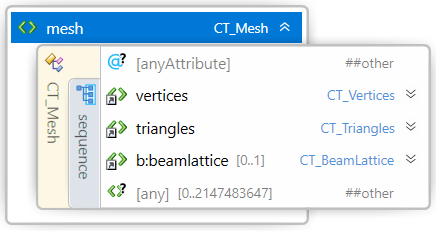
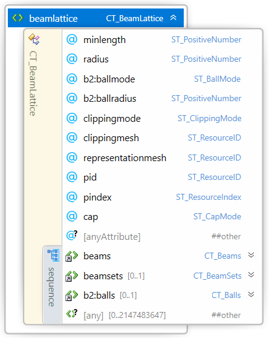

#
# 3MF Beam Lattice Extension

## Specification & Reference Guide

| **Version** | 1.01 |
| --- | --- |
| **Status** | Published |

##Table of Contents

[Preface](#preface)
[About this Specification](#11-about-this-specification)
[Document Conventions](#12-document-conventions)
[Language Notes](#13-language-notes)
[Software Conformance](#)
[Part I: 3MF Documents](#)
[Chapter 1. Overview of Additions]()
[Chapter 2. Object]()
[2.1.        Beamlattice]()
[2.1.1.        Beams]()
[2.1.2.        Beamsets]()
[2.1.3.        Beam Set-Elements]()
[Part II. Appendixes]()
[Appendix A. Glossary]()
[Appendix B. 3MF XSD Schema]()
[Appendix C. Standard Namespace]()
[Appendix D: Example file]()
[References]()

# Preface

## 1.1. About this Specification

This 3MF beam lattice specification is an extension to the core 3MF specification. This document cannot stand alone and only applies as an addendum to the core 3MF specification. Usage of this and any other 3MF extensions follow an a la carte model, defined in the core 3MF specification.

Part I, "3MF Documents," presents the details of the primarily XML-based 3MF Document format. This section describes the XML markup that defines the composition of 3D documents and the appearance of each model within the document.

Part II, "Appendixes," contains additional technical details and schemas too extensive to include in the main body of the text as well as convenient reference information.

The information contained in this specification is subject to change. Every effort has been made to ensure its accuracy at the time of publication.

This extension MUST be used only with Core specification 1.x.

## 1.2. Document Conventions

Except where otherwise noted, syntax descriptions are expressed in the ABNF format as defined in RFC 4234.

Glossary terms are formatted like _this_.

Syntax descriptions and code are formatted in `monospace.` type.

Replaceable items, that is, an item intended to be replaced by a value, are formatted in _`monospace cursive`_ type.

Notes are formatted as follows:

>**Note:** This is a note.

## 1.3. Language Notes

In this specification, the words that are used to define the significance of each requirement are written in uppercase. These words are used in accordance with their definitions in RFC 2119, and their respective meanings are reproduced below:

- _MUST._ This word, or the adjective "REQUIRED," means that the item is an absolute requirement of the specification.
- _SHOULD._ This word, or the adjective "RECOMMENDED," means that there may exist valid reasons in particular circumstances to ignore this item, but the full implications should be understood and the case carefully weighed before choosing a different course.
- _MAY._ This word, or the adjective "OPTIONAL," means that this item is truly optional. For example, one implementation may choose to include the item because a particular marketplace or scenario requires it or because it enhances the product. Another implementation may omit the same item.

## 1.4.Software Conformance

Most requirements are expressed as format or package requirements rather than implementation requirements.

In order for consumers to be considered conformant, they must observe the following rules:

- They MUST NOT report errors when processing conforming instances of the document format except when forced to do so by resource exhaustion.
- They SHOULD report errors when processing non-conforming instances of the document format when doing so does not pose an undue processing or performance burden.

In order for producers to be considered conformant, they must observe the following rules:

- They MUST NOT generate any new, non-conforming instances of the document format.
- They MUST NOT introduce any non-conformance when modifying an instance of the document format.

Editing applications are subject to all of the above rules.

# Part I: 3MF Documents

# Chapter 1. Overview of Additions

This document describes new elements, each of which is OPTIONAL for producers, but MUST be supported by consumers that specify support for this beam lattice extension of 3MF.

The central idea of this extension is to enrich the geometry notion of 3MF with beam lattice elements that can represent small-scale lattices as well as larger truss structures – both of which are quite inefficient to handle with a mesh representation, especially in cases where the element count grows into large numbers.

In order to find a balance between implementation complexity and capabilities, in this version of the specification all lattice beams are required to have a circular cross section. This reduces anisotropy issues that would be introduced by non-rotational geometries. Any additional capabilities MAY be handled by further (either public or private) extensions.

While this is meant to be an exact specification of the lattice geometry, and consumers MUST interpret it as such, the intent is also for applications in which editors can use the data structures for efficient interoperability and post processing the geometry in an intermediate step.

A producer using the lattice specification MUST mark the extension as required, as described in the core specification.

##### Figure 2-1: Overview of model XML structure of 3MF with beam lattice additions

#####

# Chapter 2. Object

Element **<mesh>**

This 3MF extension specification defines a new <beamlattice> element that lives as child of the <mesh> element from the core 3MF specification, as the lattice structures are intended to be subject to the same coordinate system as the underlying mesh.  A beamlattice MUST only be added to a mesh object of type "model" or "solidsupport".

The triangle mesh geometry MUST be unified with the lattice geometry according to the positive fill rule (for the triangles). In case of an overlap, the properties of the triangle mesh geometry MUST prevail in the overlapping region.

If a beamlattice is added to a mesh object, the mesh MAY consist of no triangles. This allows the representation of lattice-only objects.

>**Note:** This is relaxing the rules of the core specification, but is not a breaking change, as the beamlattice extension MUST always be a required extension.

This implies that the geometric surface of the lattice MUST be transformed as the mesh itself, i.e. translated, rotated, scaled and sheared as defined in the build items and components of the core specification.

>**Note:** The corresponding rules for mirroring are applied implicitly.

1.
  1. 1.1. Beamlattice

Element **<beamlattice>**

| Attributes |
| Name   | Type   | Use   | Default   | Annotation |
| --- | --- | --- | --- | --- |
| minlength | **ST\_PositiveNumber** | required |   | A producer MUST specify the minimal length of all beams in the lattice. The producer MUST NOT produce zero length beams (i.e. shorter than minlength). The consumer MUST ignore all beams with length shorter than minlength. |
| radius   | **ST\_PositiveNumber** | required |   | Default uniform radius value for the beams. |
| clippingmode | **ST\_ClippingMode** | optional | none | Specifies the clipping mode of the beam lattice. Possible values are:
- **none** : The lattice is not clipped at any mesh boundary.
- **inside** : The lattice is clipped by the volume described by the referenced clippingmesh. All geometry inside the volume (according to the positive fill rule) is retained.
- **outside** : The lattice is clipped by the volume described by the referenced clippingmesh. All geometry outside the volume (according to the positive fill rule) is retained.
If clipping mode is not equal to "none", a clippingmesh resource MUST be specified. |
| clippingmesh   | **ST\_ResourceID** | optional   |   | Required, if clippingmode is different to "none". The clippingmesh attribute MUST reference an object id earlier in the file. The object MUST be a mesh object of type "model" (i.e. not a components object), and MUST NOT contain a beamlattice. The clippingmesh id MUST NOT be a self-reference (i.e. the id references the object that contains the beam lattice). |
| representationmesh | **ST\_ResourceID** | optional  |   | References a mesh object that represents the intentional shape of the lattice geometry. It is up to the producer to decide the appropriate level of fidelity of the geometry. The consumer MAY use this for display and preview purposes and MUST NOT use it for manufacturing the part.The object MUST be a mesh object of type "model" (i.e. not a components object). The representationmesh id MUST NOT be a self-reference (i.e. the id references the object that contains the beam lattice). The representationmesh attribute MUST reference an object id earlier in the file. |
| pid | **ST\_ResourceID** | optional |   | Overrides the object-level pid as default for all beams. |
| pindex | **ST\_ResourceIndex** | optional |   | Overrides the object-level pindex as default for all beams. |
| cap   | **ST\_CapMode** | optional | sphere   | Default capping mode for beam ends (see below). Possible values:
- "hemisphere": the beam end will be closed at its end nodes by a half sphere.
- "sphere": the beam end will be closed at its end nodes by a sphere.
- "butt": the beam end will be closed with a flat end and therefore have a cylindrical or conical shape. |

A _beam lattice node_ provides information about _lattice_ data, in the form of a simplistic node-beam model as part of the mesh.

A <beamlattice> element acts as a container for beams and beam sets. The lattice MAY be geometrically clipped against a reference mesh. The clipping mode determines which parts of the lattice define the final geometry.

